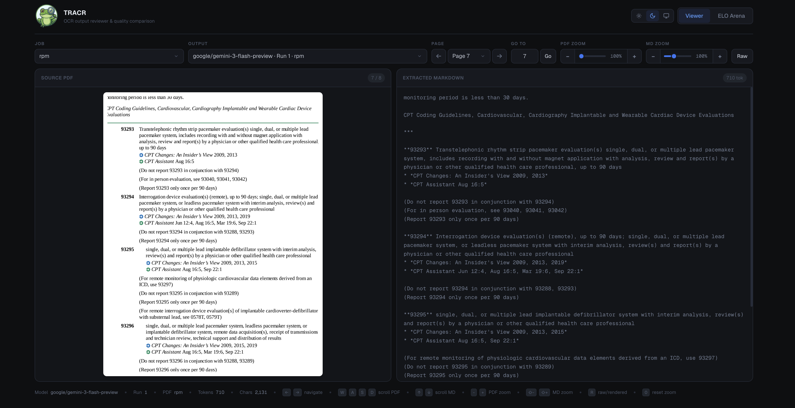
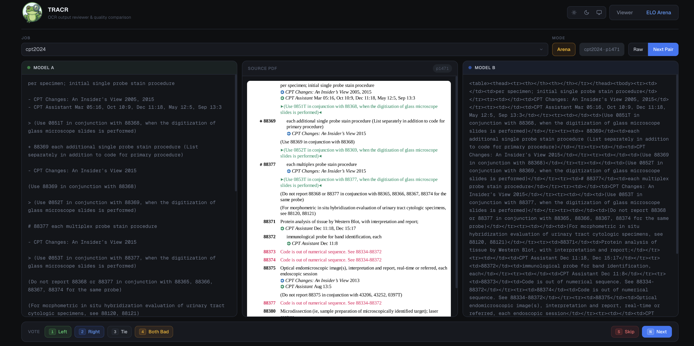

<p align="center">
  
</p>

<h1 align="center">TRACR</h1>

<p align="center">
  <strong>Toad Research 🐸 AI 😉 Character Recognition</strong><br />
  OCR orchestration for cloud APIs and local vLLM models
</p>

<p align="center">
  <a href="#install-uv">Install</a>
  ·
  <a href="#run">Run</a>
  ·
  <a href="#screenshots">Screenshots</a>
  ·
  <a href="#web-reviewer--elo">Web Reviewer + ELO</a>
  ·
  <a href="AGENTS.md">Contributor Notes</a>
</p>

Cloud-ready OCR orchestration service with:
- OpenAI-compatible routing (`base_url` + API key)
- Local OCR model execution via vLLM (optional dependency)
- Textual/Rich TUI for launching and monitoring jobs
- Structured outputs + metadata for multi-model runs
- Built-in web reviewer + ELO comparison workflow

TRACR uses a unified OpenAI-compatible client for provider swaps, optional local vLLM runtime management, and parallel model-run orchestration.

Contributor architecture and endpoint notes: `AGENTS.md`.

## Screenshots


#### Web Viewer

<p align="center">
  
</p>

#### ELO Viewer

<p align="center">
  
</p>


## Installation

First, clone the repo and enter it.

```bash
uv sync
```

For local vLLM mode:

```bash
uv sync --extra local
```

Note: local vLLM dependencies currently require Python `3.11`-`3.13` (not `3.14` yet due upstream `ray` wheel availability).

For web reviewer + ELO markdown rendering:

```bash
uv sync --extra web
```

Install both optional stacks:

```bash
uv sync --extra local --extra web
```

Copy environment template:

```bash
cp .example.env .env
```

## Run

Run API + TUI together (single-command local operator mode):

```bash
uv run tracr
```

This starts the API in the background and opens the TUI in the foreground.

Or run them separately (recommended for production and remote setups):

Start API server:

```bash
uv run tracr api
```

Start TUI (in another terminal):

```bash
uv run tracr tui
```

Start web reviewer + ELO arena:

```bash
uv run tracr web
# or
uv run web
```

Use `--no-open` to skip auto-opening a browser tab.

Launch flow is keyboard-first and multi-step (wizard pages), with no mouse required.
Set `Job id` in the wizard to use that exact `outputs/<job_id>` folder (no timestamp suffix).
Key launch shortcuts:
- `Ctrl+N`: next step
- `Ctrl+B`: previous step
- `Ctrl+A`: add current API/local model selection to queued models
- `Ctrl+L`: launch job
- `F5`: check API key status on API page
- `Esc`: cancel wizard

Home view shortcuts:
- `Enter` or `M`: open selected job monitor (per-model progress + GPU)
- `V`: open selected job output pages viewer
- `O`: open outputs browser (metadata + markdown preview)
- `D`: dismiss selected completed/canceled job from home view
- `Left/Right`: switch completed pages in job viewer
- `Up/Down`: scroll current page in job viewer
- `R`: refresh page list in viewer

Standalone vLLM launch:

```bash
uv run tracr vllm-launch lightonai/LightOnOCR-2-1B --num-gpus 1 --data-parallel-size 1 --port 9000
```

Run all tests:

```bash
uv run tracr test
```

Pass through pytest args:

```bash
uv run tracr test -- -k output_layout
```

## Inputs

Put PDFs (or nested folders) under:

```text
inputs/
```

TUI lets you:
- select files/folders from `inputs/`
- or type any absolute/relative path manually

Job configuration YAML files can be stored under:

```text
job_configs/
```

In the wizard Input step you can:
- select a YAML config from `job_configs/`
- or type any YAML path manually
- load it to prefill input/job/prompt/model settings and model queue

## API Mode

In launch flow, choose provider preset (OpenAI/OpenRouter/Gemini) or custom endpoint.
Preset selection also shows example model IDs for each provider.

The TUI checks `.env` key presence (by configured env var). If missing, enter an inline key in the form.
Use `Add API Model(s)` to queue multiple API models/providers in one job.

Model queue meaning:
- queue = launch list of model configurations captured in wizard
- execution is concurrent per model at runtime (not sequential), except local runs may wait for free GPUs

## Local Mode

Default OCR model list:
- `lightonai/LightOnOCR-2-1B`
- `zai-org/GLM-OCR`
- `PaddlePaddle/PaddleOCR-VL-1.5`
- `allenai/olmOCR-2-7B-1025`
- `datalab-to/chandra`

`zai-org/GLM-OCR` note (per model docs): if startup fails with `glm_ocr` architecture errors,
upgrade local runtime stack:

```bash
uv pip install -U --pre vllm --extra-index-url https://wheels.vllm.ai/nightly
uv pip install -U git+https://github.com/huggingface/transformers.git
```

You can add any custom Hugging Face model id (`org/model`).
Use `Add Local Model(s)` to queue local models without leaving the wizard.

GPU-aware local scheduling is built in:
- local runs wait when insufficient GPUs are available
- vLLM servers are started on-demand
- vLLM launch uses OLMoCR-style serve flags (`tp`, `dp`, bounded multimodal prompt config, quieter request logs)
- page OCR is executed with bounded in-flight request batching (`max_concurrent_requests`)
- resources are released when runs end

## Output Layout

Outputs are stored as:

```text
outputs/<job_id>/<org-name-model-name>/run-<run_num>/<pdf_slug>/<page_num>.md
```

Examples:

```text
outputs/invoices-20260206-120005/lightonai-LightOnOCR-2-1B/run-1/doc-a/1.md
outputs/invoices-20260206-120005/lightonai-LightOnOCR-2-1B/run-1/doc-a/2.md
```

Metadata files are written at each level:
- `outputs/<job_id>/job_metadata.json`
- `outputs/<job_id>/<model_slug>/model_metadata.json`
- `outputs/<job_id>/<model_slug>/run-<run_num>/run_metadata.json`
- `outputs/<job_id>/<model_slug>/run-<run_num>/<pdf_slug>/pdf_metadata.json`

Metadata now includes processing stats:
- `job_metadata.json`: global rollups (time + token usage across all runs/pages)
- `run_metadata.json`: per-model-run rollups
- `pdf_metadata.json`: per-PDF rollups plus page-level entries (`pages[]`) with per-page timing, token usage, status, and errors
- Markdown viewers in TUI show per-page output token count and character count when available.

If the same `job_id` is reused, new model runs increment `run_num` and append under that job.

## Web Reviewer + ELO

TRACR includes a dedicated web interface at `/web`:
- **Output Viewer**: choose a job/output, inspect original PDF page side-by-side with extracted markdown
- **Markdown mode toggle**: switch between rendered markdown and raw markdown text
- **ELO Arena mode**: blind compare model outputs as `Model A` vs `Model B` (sides may swap between pairs)
- **ELO Browse mode**: lock a model pair and step across shared pages for targeted comparisons

ELO vote controls:
- `1`: `Left`
- `2`: `Right`
- `3`: `Tie`
- `4`: `Both Bad`
- `S`: `Skip`
- `N`: `Next Pair`

Other ELO controls:
- `R`: toggle raw/rendered markdown
- `B`: toggle Arena/Browse mode
- `Left/Right Arrow`: move pages in Browse mode

ELO artifacts are saved under:

```text
outputs/<job_id>/elo/
```

including rating state (`ratings.json`) and vote history (`votes.jsonl`).

Contributor-facing architecture notes and the full endpoint inventory are maintained in `AGENTS.md`.
